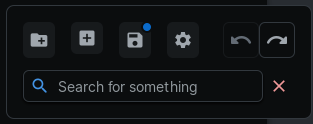
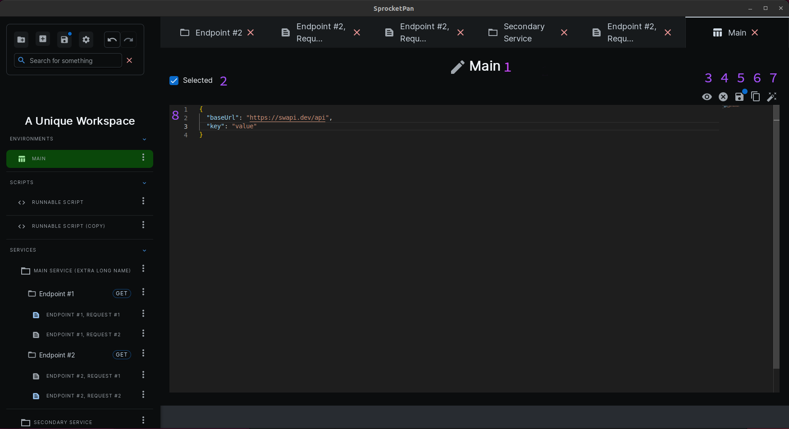
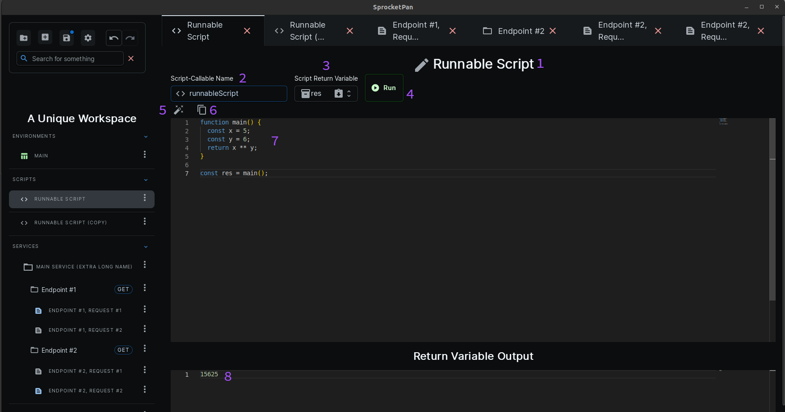
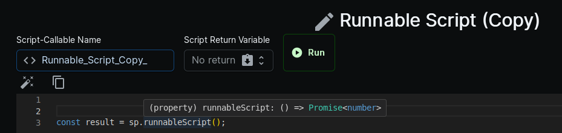
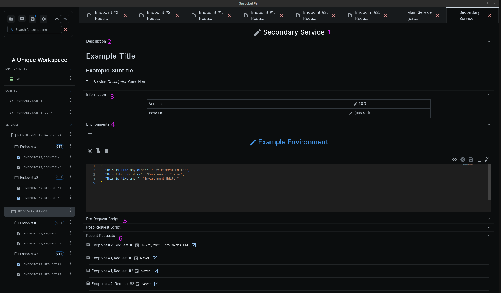

# Panels

## Settings

The Settings Panel allows the user to change different settings within Sprocket Pan. Settings are per-workspace. The Settings Panel can be opened with the gear button in the toolbar.

Whenever a setting is changed, the buttons in the bottom life corner will change to `Cancel` and `Apply` respectively. Click the `Cancel` button to clear all changes, or the `Apply` button to save changes.

There are three sub-sections within the settings panel - `general`, `requests`, and `data`.

### General

In the general settings menu, you can control the window zoom, the system theme (dark or light mode), and how you want variables to be displayed. The variable display setting is used for [environment](../terminology/#environment) variables. The below example(s) show what it looks like for each setting:

* Key and Value

* Value Only

### Requests

The request settings menu has the options for the network call timeout duration, the maximum number of [history](../terminology/#history) records, and the [script](../terminology/#script) strategy order. For the network call timeout duration

### Data

The data folder deals with saving, quitting to the [workspace selection screen](../../getting-started/layout/#workspace-selection-screen), and opening the data folder in your system's file explorer. You will rarely need to do this, but the `Open Data Folder` button will open the location of all of the data in Sprocket Pan in your system's file explorer.  

## Environment

The environment panel allows for editing of environments.

(1) The Title

  * This text is editable. The title does not need to be unique, but it is reccomended to give it a unique and recognziable name.

(2) Selected Checkmark Toggle

  * Click this to toggle whether the environment is selected. Selecting an environment will also un-select all other environments since a maximum of one environment can be selected at any one time.

(3) View/Edit toggle

  * Toggle between view and edit mode. The default mode, edit mode, will function as normal. View mode switches the editor to read-only, and replaces all references to environment variables with their resolved value.

=== "Edit Mode"

    

=== "View Mode"

    

(4) Clear Changes

  * Clears all unsaved changes, reverting the editor to its untouched state.

(5) Save Changes

  * Saves all unsaved changes. Note that this will not save to disk, only memory. If you'd like to save to disk, the save button in the floating toolbar (top-left), is how to do it.

(6) Copy to clipboard

  * Copies the environment text to the clipboard.

(7) Format

  * Formats the text in the editor.

(8) Environment Editor

  * A monaco (vscode) JSON editor for the environment variables. Only supports string keys and string values.

## Script

The script panel allows for the editing of standalone-scripts.

(1) The Title

  * This text is editable. The title does not need to be unique, but it is reccomended to give it a unique and recognziable name.

(2) Script-Callable Name

  * The name that will be used when referencing this script in any script. This name must be unique, and be a valid variable name in Typescript.

(3) Script Return Variable

  * The name of the variable this script returns. This value can be blank. If it is not, then whenever this script is called, it will return the selected variable wrapped in a `Promise`.
  

(4) Run

  * Runs the script as is, and outputs the script's return variable, if it exists.

(5) Format

  * Formats the text in the editor.

(6) Copy to clipboard

  * Copies the script text to the clipboard.

(7) Script Editor

  * A monaco (vscode) Typescript editor for the environment variables.

(8) Return Variable Output

  * Shows the script's return variable's value, if it exists, once a script has been run.

## Service

The service panel allows for editing services.

(1) The Title

  * This text is editable. The title does not need to be unique, but it is reccomended to give it a unique and recognziable name.

(2) Description

  * A description of the service. Be as verbose or succinct as you wish. Displays in markdown.

(3) Information Table

  * General information about the service. The baseurl will be prepended to all requests, and you **can** use environment variables.

(4) Environments

  * Services can have environments local to that service. Click the first circle button to select or deselect the environment. The next button will allow you to duplicate the local environment, and the third button is for deleting the local environment. The buttons/features are otherwise exactly the same as the [Environment Panel](#environment)

(5) Pre- and Post-Request Scripts

  * Scripts that will run before and after any request is run in the service.

(6) Recent Requests

  * A list of the most recent requests that were called, with the date they were last used and a link to open their [Request Panel](#request)

## Endpoint

## Request
