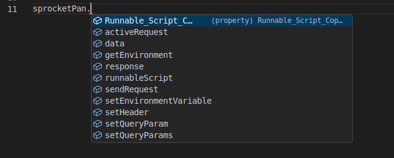

# Terminology

## Panel

## File System

### Script

Scripts in Sprocket Pan are powerful tools that enable the user to perform some very advanced actions. One common workflow for engineers is to need to get an Auth token, if they do not already have one, before they send a given request. Another common workflow is to send a request to multiple services at once, and compare the results. Scripts enable that. Let's explore how they work.

Firstly, all scripts are in Typescript, but the types are only there to help you, and if you are only familiar with Javascript, you will not need to learn anything new in order to write scripts. Most JS language features are available, and there is also an additional variable that you can reference to perform actions specific to Sprocket Pan - the `sprocketPan` variable (aliased to `sp`).

Let's run through the different fields:

#### activeRequest

 * (could be null) The active request that the script is being run on, if it exists. If you run a standalone script manually, this will be null.

#### data

 * A read-only copy of the entire application data. Not sure why you'd need it, but it is there if you want it.

#### getEnvironment

 * A function with no arguments that returns all of the environment variables (key/value map) as an object.

#### response

 * (could be null) The latest response on the activeRequest, if it exists.

#### sendRequest

 * Allows you to send another Sprocket Pan request programatically. Takes one argument, which is the [request ID](../panels/#gitrequestid).

#### setEnvironmentVariable

* Takes in 2-3 arguments
  
    * Key: string - the key in the environment to set

    * Value: string - the value to set

    * (Optional) Level: 'request' | 'service' | 'global' - which environment to set the key/value in. Defaults to the request level unless the request is null, then will always set the globally selected environment.

#### setHeader

 * Takes in a key and a value (strings), and saves the new header at the request level.

#### setQueryParam

 * Takes in a key and a value, and adds the given value the array of values for the key, of it exists, or creates a new key/value pair if not. (Query Params can have multiple values for a given key)

#### setQueryParams

 * Takes in a key (string) and a value (array of strings), and overrides the query param at a given key to be the list of values passed in.

#### All Scripts

 * Any and all globally-defined / standalone scripts will also be available as a field in the `sprocketPan` variable, referrable by their [Script-Callable Name](../panels/#scriptcallablename). In the screenshot above, you can see we have two scripts defined with the names `Runnable_Script_Copy_` and `runnableScript` respectively.

 * The return type of standalone scripts will always be the type of whatever the [Script Return Variable](../panels/#scriptreturnvariable) is, wrapped in a promise. It is recommended that you `await` a script whenever you call it, as it may or may not be asynchronous.

### Service

### Environment

### Endpoint

### Request

#### History
