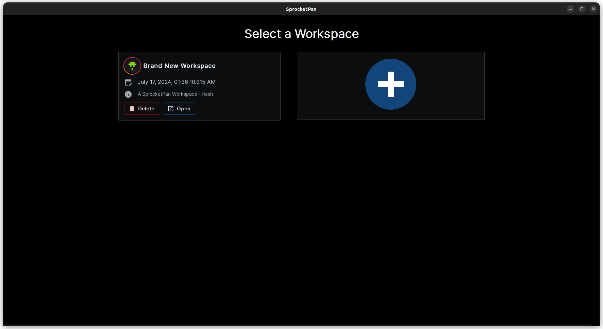
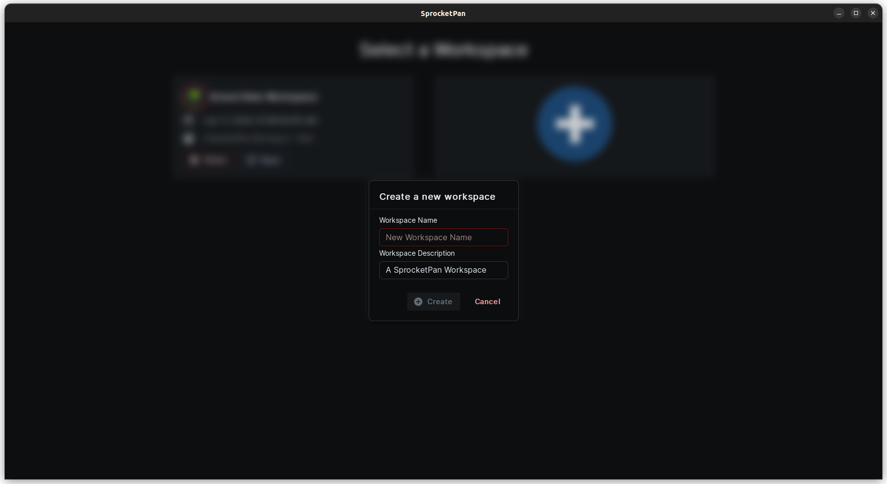
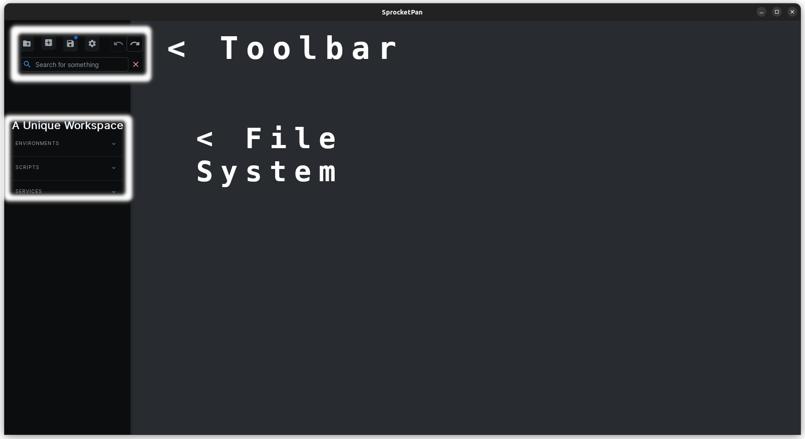
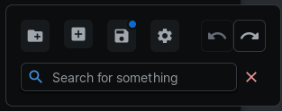

# Layout of Sprocket Pan

## Workspace Selection Screen

Sprocket Pan is organized at the top level by workspaces. Each workspace should be fully seperate from other workspaces since workspaces are unable to cross-reference each other's data or requests. There is no limit to how much you can put inside a single workspace, and workspaces exist as an organizational tool in order to allow totally seperate things to be distinct and easy to seperately access.

In the workspace selection screen, you can click the giant blue and white plus button to create a new workspace.

You can then fill out the creation modal and hit create. Once you do, a new workspace will be created. 	

You can open a workspace by clicking on the `Open` button.

## Sprocket Pan Workspace Screen

### Toolbar

The toolbar is a floating set of actions that the user can take to interact with Sprocket Pan. Like all other buttons in SP, highlighting over any of the toolbar actions will show a tooltip description.

#### Import From File

The first button in the top row of buttons, `Import from File` opens up a file selection dialog. SP currently supports openAPI/swagger docs versions `2`, `3` and `3.1`. You can click on any openAPI `JSON` or `yaml` file to load the document into SP.

#### Create New

The second button in the top row, `Create New`, will allow you to make any of the root file system items, either a new [Service](../terminology/#service), [Environment](../terminology/#environment), or [Script](../terminology/#script).

#### Save

Remember to save often! This button will save all of your changes to the filesystem. An auto-save feature is in the works.

#### Settings

This button opens the [settings](../panels/#settings) menu.

#### Tab Navigation

#### Search

### File System

#### Environments

#### Scripts

#### Services

#### Service Endpoints

#### Endpoint Requests
