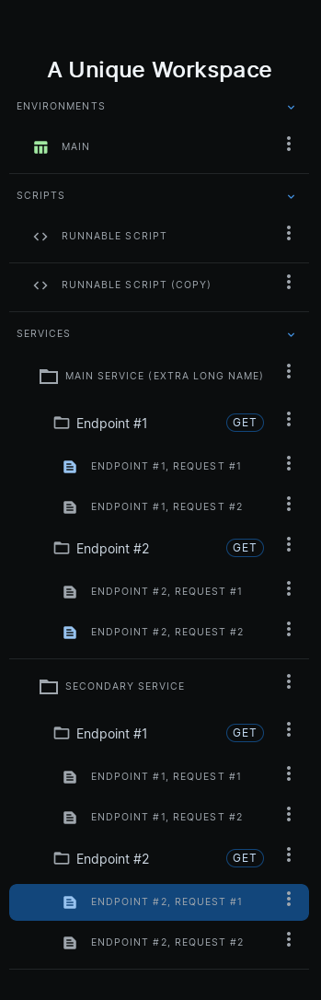
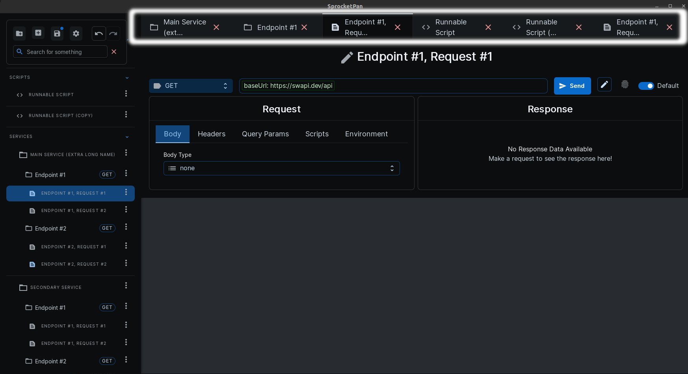

# Layout of Sprocket Pan

## Workspace Selection Screen

Sprocket Pan is organized at the top level by workspaces. Each workspace should be fully seperate from other workspaces since workspaces are unable to cross-reference each other's data or requests. There is no limit to how much you can put inside a single workspace, and workspaces exist as an organizational tool in order to allow totally seperate things to be distinct and easy to seperately access.

In the workspace selection screen, you can click the giant blue and white plus button to create a new workspace.

You can then fill out the creation modal and hit create. Once you do, a new workspace will be created. 	

You can open a workspace by clicking on the `Open` button.

## Sprocket Pan Workspace Screen

### Toolbar

The toolbar is a floating set of actions that the user can take to interact with Sprocket Pan. Like all other buttons in SP, highlighting over any of the toolbar actions will show a tooltip description.

#### Import From File

The first button in the top row of buttons, `Import from File` opens up a file selection dialog. SP currently supports openAPI/swagger docs versions `2`, `3` and `3.1`. You can click on any openAPI `JSON` or `yaml` file to load the document into SP.

#### Create New

The second button in the top row, `Create New`, will allow you to make any of the root file system items, either a new [Service](../../documentation/terminology/#service), [Environment](../../documentation/terminology/#environment), or [Script](../../documentation/terminology/#script).

#### Save

Remember to save often! This button will save all of your changes to the filesystem. An auto-save feature is in the works.

#### Settings

This button opens the [settings](../../documentation/panels/#settings) menu.

#### Tab Navigation

When you click through different tabs, the history/order of the tabs you selected is preserved. This way, you can quickly naviate to a previously selected tab (and then go 'forward' again to the tab you just left) with these buttons.

#### Search

As the file system grows, finding exactly what you want through a visual search can get cumbersone. The search bar will search through everything in the file system to help you find exactly what you need.

### File System

The file system contains everything saved to Sprocket Pan - [Environments](../../documentation/terminology/#environment), [Scripts](../../documentation/terminology/#script), [Services](../../documentation/terminology/#service), [Endpoints](../../documentation/terminology/#endpoint), and [Requests](../../documentation/terminology/#request).

The file system is split into three section - Environments, Scripts, and Services. Within services are endpoints, which themselves contain requests. Clicking on any item in the file system will open up the corresponding tab.

### Tabs

Tabs are the displayed data and options when an item in the file system is selected. Clicking on the tab at the top will open up the information about that tab, as well as scroll to the corresponding file system entry. Similarly, clicking on an item in the file system will scroll to the tab at the top, if it is already opened.

[:arrow_left: Download](../download){ .md-button }
[:arrow_right: View the docs](../../documentation/panels){ .md-button }
